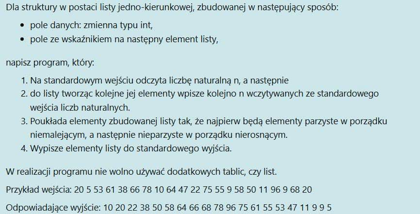

# Zadania

---

## Grupa 1


## Grupa 2


## Grupa 3




## Grupa 4


# WAŻNE FUNKCJE
### 1. Funkcja przyjmuje stringa i sprawdza czy jest w nim chociaż jeden polski znak
```cpp
bool czy_slowo_ma_polski_znak(string slowo) {
    for (int i=0; i<slowo.length(); i++) {
        int literka = static_cast<int>(slowo[i]);
        cout << "Literka " << slowo[i];
        if ((literka >= 65 && literka <= 90) || (literka >= 97 && literka <= 122))
            continue;
        else
            return true;
    }

    return false;
}
```
---
### 2. Funkcja sortuje pacjentów wg wagi
>  Jeśli ma sortować malejąco >
> 
>  Jeśli ma sortować rosnąco <
> 
>  Jeśli ma sortować coś innego niż wage to zamień .waga
```cpp
void sortowanie(Pacjent *pacjenci, int n) {
    for (int i=0; i<n; i++)
        for (int j=0; j<n-i-1; j++)
            if (pacjenci[j].waga > pacjenci[j+1].waga)
                swap(pacjenci[j], pacjenci[j+1]);
}
```
---
### 3. Funkcja rekurencyjna do wyszukiwania binarnego
> W przykładzie wyszukujemy nazwisko
```cpp
bool wyszukiwanieRekurencyjne(Pacjent *pacjenci, int lewy, int prawy, string nazwisko) {
    if (lewy > prawy)
        return false;

    int srodek = lewy + (prawy - lewy) / 2;

    if (pacjenci[srodek].nazwisko == nazwisko)
        return true;

    if (pacjenci[srodek].nazwisko < nazwisko) // szukanie w prawo
        return wyszukiwanieRekurencyjne(pacjenci, srodek + 1, prawy, nazwisko);
    else // szukanie w lewo
        return wyszukiwanieRekurencyjne(pacjenci, lewy, srodek - 1, nazwisko);
}
```